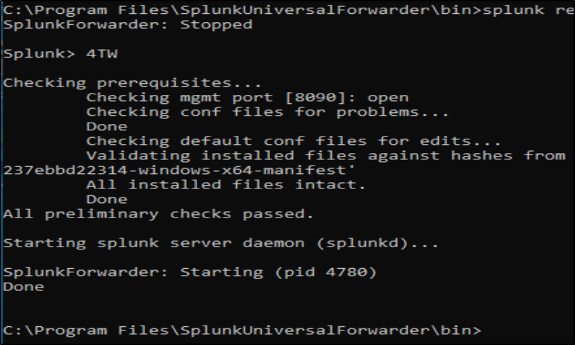

<h1 align="center">📊 Monitoring Active Directory with Splunk</h1>

  All done on a Windows Server 2022 VM.

<h2>🎮 Side Quest: Setting up Active Directory Domain</h2>

Before configuring Splunk, a basic Active Directory domain was created on the same Windows Server 2022 instance. A test user was added to verify login functionality. Initially, logging in failed because the user lacked administrative privileges (since I was using the same Windows 2022 Server VM to login with the test user). To resolve this, the test user was added to the <strong>“Domain Admins”</strong> group via Group Policy. After this change, login succeeded. The user was also set to reset their password upon first login which worked as intended.

<h2>🛠️ Deployment & Integration Processes</h2>

<ol>
  <li>
    Made a Windows 2022 Server to host the Splunk enterprise server and add Splunk Universal Forwarder to. 
  </li>

  <li>
     Set up the Splunk Enterprise Server on <code>localhost:8000</code> and configured a receiving rule on port <code>9997</code>. 
  </li>

  <li>
    Setup the Splunk Universal Forwarder's receiving indexer to send data provided the Windows 2022 Server IP and port <code>9997.</code> 
    
  </li>

  <li>
    Created a new <code>local</code> folder in: 
    <code>C:\Program Files\SplunkUniversalForwarder\etc\apps\search</code> 
    
  </li>

  <li>
    Set up <code>inputs.conf</code> file in this folder. 
    
  </li>

  <li>
    Restarted Splunk from within the <code>C:\Program Files\SplunkUniversalForwarder\bin</code> directory to save and apply changes made to these configuration files. 
    
  </li>

  <li>
    Created an index on the Splunk Server's web interface to match name specified <code>inputs.conf</code> file. 
    
  </li>

  <li>
    Created user in Active Directory to test monitoring on Splunk. 
    
  </li>
  <li>
    Put the user in <code>Domain Admins</code> group so I can use same computer for testing purposes of Splunk enterprise and forwarder. 
      
  </li>
  <li>
    After some messing around in AD and creating a user we were able to see that 5 events were logged in the <code>ad_index</code>index that was created earlier. 
    
  </li>

<li>
  Queried all logs within <code>ad_index</code> and saw the 5 events were all sourced from Active Directory. This indicated the active monitoring of AD through Splunk and that it was configured correctly. 

  <ul style="list-style-type: lower-alpha; padding-left: 20px;">
    <li>
      <strong>Search query and log results:</strong> 
       
    </li>
    <li>
      <strong>Table View:</strong> All events are from Active Directory, and <code>host</code> matches the PC name of the Windows Server 2022 instance. 
      
    </li>
  </ul>
</li>

  <li>
    Upon deeper inspection of the latest event, detailed information was shown — including user settings, password expiration status, etc. 
    
  </li>

  <li>
    Narrowed the search to user <strong>John</strong> and found that 4 of the 5 AD events were associated with this user/creation of this user. 
    
  </li>

  <li>
     Gave user <strong>John Jay</strong> Domain Admin privileges, then logged in with that account and confirmed new logs were generated. These included the user's new group/privleges. 
    
  </li>

<!-- last step begins here-->
<li>
  Used a PowerShell script to automate creating <strong>1,000 new users</strong> and verified that a lot more logs were generated in Splunk, specifically for all the new users that were created via the PS script. 

  <ul style="list-style-type: lower-alpha; padding-left: 20px;">
    <li>
      <strong>PS script for creating 1000 users automatically:</strong> 
       
    </li>
    <li>
      <strong>Script running:</strong> 
       
    </li>
    <li>
      <strong>_USERS directory created in Active Directory under my domain:</strong> 
       
    </li>
    <li>
      <strong>_USERS populated with the 1000 users:</strong> 
       
    </li>
    <li>
      <strong>Events that were generated and forwarded from Active Directory to Splunk with this automation (3.5K+ logs!):</strong> 
      
    </li>
  </ul>
</li>
<!-- last step ends here-->

</ol>

